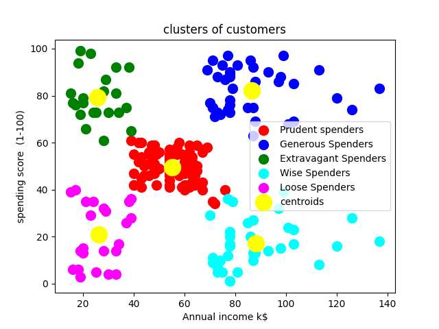

 # K-Means Clustering with FastAPI and Streamlit

## Table of Contents
- [Description](#description)
- [Requirements](#requirements)
- [Getting Started](#getting-started)
  - [1. Train and Save the Model](#1-train-and-save-the-model)
  - [2. Deploy FastAPI](#2-deploy-fastapi)
  - [3. Run Streamlit](#3-run-streamlit)
- [Usage](#usage)
  - [FastAPI Endpoints](#fastapi-endpoints)
  - [Streamlit Application](#streamlit-application)
- [Example Input and Output](#example-input-and-output)
- [File Structure](#file-structure)
- [Cluster Visualizations](#cluster-visualizations)
- [License](#license)

---

## Description

This project demonstrates a complete implementation of a K-Means clustering model using Scikit-Learn, deployed with FastAPI and integrated with a Streamlit application. The model is designed to group data points into clusters based on features such as:

- Annual Income (k$)
- Spending Score (1-100)

The FastAPI backend provides an endpoint for predicting cluster assignments, while the Streamlit frontend offers an interactive interface for visualization and input.

---

## Requirements

To set up and run this project, ensure you have the following Python packages installed:

- `fastapi`
- `uvicorn`
- `scikit-learn`
- `pandas`
- `joblib`
- `numpy`
- `streamlit`

Install all dependencies using the following command:

```bash
pip install -r requirements.txt
```

---

## Getting Started

Follow these steps to set up and run the project:

### 1. Train and Save the Model

Train a K-Means clustering model and save the trained model for deployment:

```bash
python kmeans_model.py
```

This step generates a `model.pkl` file containing the trained K-Means model.

### 2. Deploy FastAPI

The FastAPI application (`api.py`) loads the saved model and provides an endpoint for cluster predictions. Start the FastAPI server using `uvicorn`:

```bash
uvicorn api:app --reload
```

This will start the server at `http://127.0.0.1:8000`.

### 3. Run Streamlit

The Streamlit app allows users to interact with the K-Means model. Start the Streamlit application:

```bash
streamlit run app.py
```

The app will open in your default browser at `http://localhost:8501`.

---

## Usage

### FastAPI Endpoints

#### POST `/predict`

- **Description**: Returns the predicted cluster for input data.
- **Input JSON**:

```json
{
  "Annual Income": 50,
  "Spending Score": 60
}
```

- **Output JSON**:

```json
{
  "cluster": 2
}
```

### Streamlit Application

The Streamlit app provides an interactive interface where users can:

1. Input values for Annual Income and Spending Score.
2. Visualize the cluster assignment.
3. Explore clustering results using dynamic charts.

---

## Example Input and Output

- **Input**:
  - Annual Income = 50
  - Spending Score = 60

- **Output**:
  - Predicted Cluster = 2

---

## File Structure

The project directory is organized as follows:

```
📦 kmeans_clustering
├─ data
│  └─ dataset.csv
├─ model
│  └─ model.pkl
├─ src
│  └─ visualization_utils.py
├─ .gitignore
├─ app.py
├─ api.py
├─ kmeans_model.py
├─ README.md
└─ requirements.txt
```

---

## Cluster Visualizations

### Example: Customer Segmentation Clusters

Below is an example visualization showing the clustering of customers based on Annual Income and Spending Score:



---

## License

This project is licensed under the [MIT License](https://opensource.org/licenses/MIT).

---

## Author

This project was developed by  Aluko Emmanuel Ooreoluwa [Aluko Emmanuel Ooreoluwa](Aluko Emmanuel Ooreoluwa) showing expertise in machine learning, FastAPI, and Streamlit development.

